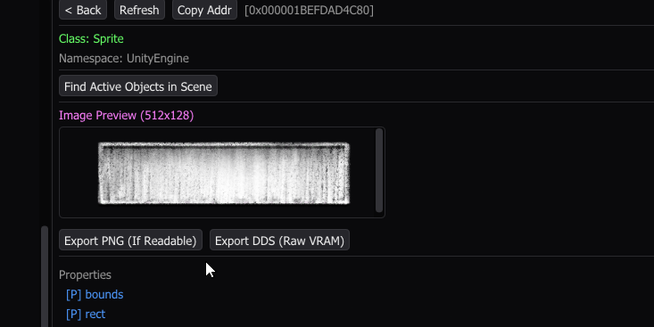
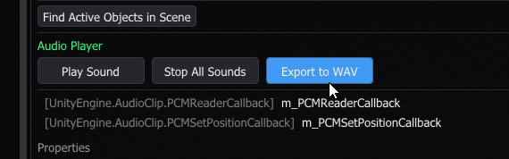

<h1 align="center">Il2CppInspectorPro</h1>

**Il2CppInspectorPro** is a C++ Modding SDK generator for IL2CPP applications.

Automates the creation of a Visual Studio solution tailored for runtime manipulation and reverse engineering.

## Features

### Dual Loading Modes
* **Proxy Mode:** Uses `version.dll` wrapper. Loads automatically with the game when `_VERSION` is defined.
* **Injector Mode:** Standard entry point for manual DLL injection.

### Runtime Unity Explorer
In-game hierarchy and object inspector.
* **Inspector:** Read/write fields and properties, invoke methods.
* **Hierarchy:** Create GameObjects, add/destroy/toggle Components in real-time.
* **Highlighter:** Visually pinpoint selected GameObjects in the scene.
* **Class Browser:** Stable, reflection-based assembly navigation.
* **UI:** ImGui styling with transparent background support to monitor live game state changes.

### Asset Viewer & Exporter

#### Sprite & Texture Viewer
- In-game visual preview for Sprite and Texture2D instances.
- **Export Options:** PNG (if CPU read/write is enabled) or DDS (Raw VRAM dump).

> [!NOTE]
> Compatibility varies. Success depends on the game's texture compression formats and memory accessibility flags.

### Audio Player & Exporter
- Live in-game playback for AudioClip instances.
- **Export Option:** Direct .wav extraction.

### Il2CppResolver
C++ wrapper for the IL2CPP domain.
* Dynamic class/method resolution and safe field access.
* Built-in `safe_call` and `SafeRuntimeInvoke` to prevent access violations during memory reads.

### DX11 & ImGui Scaffold
* Pre-configured DirectX 11 hook.
* Dear ImGui backend with a modular tab routing system.

### Hooking Scaffold
* Pre-linked with **Microsoft Detours**.
* Clean entry point in `main.cpp` for persistent hooks and patches.
